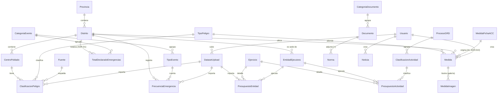

# 01 — Modelo de datos

Backend Django 5.2 LTS en `backend/apps/`. PostgreSQL 16 **sin PostGIS** (ADR-A1). Convenciones: nombres en español; todos los modelos heredan `TimeStampedMixin` (`creado_en`, `actualizado_en`); los editoriales heredan además `WorkflowMixin`. Campos marcados **[+]** = sugeridos para crecimiento futuro: se crean desde el inicio (nullables/optativos, costo cero) pero ninguna vista del MVP depende de ellos.

## Apps

`core`, `territorio`, `peligros`, `medidas`, `normativa`, `inversion`, `biblioteca`, `contenidos`, `sitio`, `mapas`, `datasets`, `metricas`, `api` (sin modelos; routers/serializers).

## Datasets Excel canónicos (fuente de verdad)

El TDR exige actualización "por carga de archivos sin asistencia técnica": el cliente sube estos Excel al admin, se procesan y **reemplazan** los datos activos. Originales en `data/layers/data/`.

> Los conteos y anomalías de esta sección salen de una auditoría de los archivos reales
> (02/08/2026). El Excel de niveles fue **actualizado por el cliente** respecto de la versión que
> alimentó el prototipo: pasó de 6,566 a 10,978 clasificaciones.

### `Base_Nivel Peligro_CCPP_Cusco.xlsx` (~5.4 MB)
9 hojas, una por peligro: `Sismo`, `Friaje`, `Inundación`, `Heladas`, `Bajas temperaturas`, `Lluvias`, `Sequía`, `Incendios Forestales`, `Movimientos en masa`. Cada hoja: 8,968 CCPP × 15 columnas:

`DEPARTAMEN, PROVINCIA, DISTRITO, CODIGO (10 díg INEI), NOMB_CPOB, CATEGORIA, ALTITUD, LONGITUD, LATITUD, POBLACION, PELIGRO, TIP_PELIG, NIVEL_PELI (1-4), Fuente, Link`

> **`POBLACION` se lee pero NO se importa** (ADR-A19). La columna existe en el archivo y sigue
> en `COLUMNAS_ESPERADAS` —la validación de estructura compara la cabecera completa y quitarla
> haría fallar la importación del archivo real— pero su valor se descarta: no es un padrón que
> el cliente haya entregado ni respaldado. El campo del modelo se conserva vacío para que baste
> reimportar el día que llegue uno oficial.

**El nombre de la hoja no es el nombre del peligro.** La fuente de verdad es la columna `PELIGRO`, que dentro de cada hoja es constante pero difiere del título en dos casos. El catálogo canónico (hoja → nombre → slug → `TIP_PELIG`) es:

| Hoja | `PELIGRO` | slug | `TIP_PELIG` | Clasificaciones |
|---|---|---|---|---|
| Sismo | Sismo | `sismo` | Geodinamica interna | 1,513 |
| Friaje | Friaje | `friaje` | Metereologicas | 163 |
| Inundación | Inundación | `inundacion` | Metereologicas | 1,446 |
| Heladas | Heladas | `heladas` | Metereologicas | 1,632 |
| Bajas temperaturas | Bajas temperaturas | `bajas_temperaturas` | Metereologicas | 944 |
| Lluvias | **Lluvias intensas** | `lluvias_intensas` | Metereologicas | 30 |
| Sequía | Sequía | `sequia` | Metereologicas | 798 |
| Incendios Forestales | **Incendios forestales** | `incendios_forestales` | Metereologicas | 1,705 |
| Movimientos en masa | Movimientos en masa | `movimientos_en_masa` | Geodinamica externa | 2,747 |

Muy **sparse**: solo **3,238 de los 8,968 CCPP** (36%) tienen alguna clasificación. "Sin dato clasificado" ≠ "nivel bajo" — el visor los pinta en gris, no en verde. Total: **10,978 clasificaciones**.

`Fuente` tiene dos valores: `SIGRID_CENEPRED` (10,929) y `SINAGERD_CENEPRED` (49, todas en Inundación).

Anomalías que el importador debe registrar sin abortar:
- **229 filas** traen `PELIGRO`, `Fuente` y `Link` pero `NIVEL_PELI` vacío (Heladas 62, Sequía 63, Incendios 51, Movimientos 41, Bajas temp. 9, Sismo 3). Se descartan: sin nivel no hay semáforo.
- **2 filas huérfanas** al final de `Incendios Forestales` (8970–8971): sin `CODIGO` ni ubicación.
- El CCPP `0806010001` (SICUANI) trae `DISTRITO` vacío en una de las hojas → al deduplicar hay que preferir el valor no vacío, no el primero que aparezca.
- No hay `CODIGO` repetido dentro de una misma hoja.

Lógica de parseo de referencia: `prototype/scripts/xlsx_to_json.py`.

### `Base_Frecuencia_Peligro_Cusco.xlsx` (~23 KB) — NUEVO, no existe en el prototipo
Hoja `NºEMERGENCIAS`: **111 filas de distrito** (falta **ACOMAYO/ACOMAYO, ubigeo 080201**) de los 112 del padrón. De esas, **64 tienen desglose por evento** y 65 traen `RANGO FECHA`. Formato **ancho**: `CUSCO, PROVINCIA, DISTRITO` + conteo por ~25 tipos de evento con subtotales por categoría:

- Geodinámica externa: `HUAYCO, DESLIZAMIENTO, ALUVIÓN, DERRUMBE, REPTACIÓN, FLUJO DE DETRITOS, TOT_GEODINAMICA EXTERNA`
- Geodinámica interna: `SISMO, TOT_GEODINAMICA INTERNA`
- Meteorológicos/oceanográficos: `HELADA, BAJA TEMPERATURA, VIENTOS FUERTES, FRIAJE, GRANIZADAS, INUNDACIÓN, LLUVIAS INTENSAS, NEVADA, SEQUÍA, DÉFICIT HÍDRICO, TORMENTA ELECTRICA, TOT_METEREOLÓGICOS / OCEANOGRÁFICOS`
- Inducidos por acción humana: `COLAPSO POR ANTIGÜEDAD, INCENDIO FORESTAL, INCENDIO, TOT_INDUCIDOS POR LA ACCIÓN HUMANA`
- Cierre: `TOTAL, RANGO FECHA, FUENTE, LINK`

**No trae ubigeo**: el importador resuelve el distrito por nombre normalizado (`unidecode(upper(strip(nombre)))`) contra `territorio.Distrito`. Verificado sobre los datos reales: **111/111 resuelven sin ambigüedad** — en Cusco no hay dos distritos homónimos, así que no hace falta desempatar por provincia. Los no-matches van al log sin abortar. Se normaliza a formato largo distrito×evento.

Particularidades de la fuente:
- **El distrito de CUSCO trae los cuatro `TOT_*` llenos (43/2/77/12, `TOTAL` 134) y todas las columnas de evento vacías.** Descartar los subtotales dejaría a la capital regional en 0 emergencias — ver **ADR-D1** y el modelo `TotalDeclaradoEmergencias`.
- Descuadres entre subtotal y desglose: SANGARARA (declara 18 meteorológicos, el desglose suma 27) y MOLLEPATA (declara 5 inducidos, suman 6). Prevalece el desglose; la diferencia va al log.
- `RANGO FECHA` tiene **23 variantes** (rango global 2000–2025) con espaciado inconsistente (`2007 - 2023` vs `2007-2023`). **Es por distrito: no existe un periodo regional único**, así que los totales no son comparables entre distritos sin decirlo.
- `FUENTE` aparece como `SIGRID_CENEPRED` (57) y `CENEPRED_SIGRID` (8) → normalizar a la primera.
- La columna `TOTAL` viene como **string**; las de evento como int.
- **Las dos fuentes clasifican distinto el mismo fenómeno**: `INCENDIO FORESTAL` es "inducido por acción humana" aquí, mientras que en el Excel de niveles `Incendios forestales` lleva `TIP_PELIG = Metereologicas`. Cada eje conserva su taxonomía de origen; la UI no las mezcla.

## Modelos por app

### core
```python
class TimeStampedMixin(models.Model):        # abstract
    creado_en / actualizado_en

class WorkflowMixin(models.Model):           # abstract
    estado          # choices: borrador | publicado | archivado; default borrador; db_index
                    # «revision» se retiró con ADR-P3, con migración de datos en las 5 apps
    publicado_en    # datetime null
    creado_por      # FK User SET_NULL
    revisado_por    # [+] FK User null — hoy: quién publicó o retiró (nombre heredado, ADR-P3)
    nota_revision   # [+] Text — hoy: por qué se retiró del sitio
    # Manager .publicados(); método transicionar(nuevo_estado, usuario):
    #   valida transición y permisos, setea publicado_en, encola email (ver 03-admin-editorial)
```
Se aplica a: Medida, Norma, Documento, Noticia, Video, Evento, HeroSlide. También viven aquí `services/gemini.py`, `services/meili.py` y tareas comunes.

### territorio
| Modelo | Campos | Claves/índices |
|---|---|---|
| `Provincia` | `ubigeo` char(4) unique, `nombre`; [+] `poblacion_censo`, `superficie_km2` | 13 filas |
| `Distrito` | `ubigeo` char(6) unique, FK `provincia`, `nombre`, `nombre_normalizado` (index; para resolver Excel de frecuencia), **`lat`/`lon`** = centroide de su polígono (ADR-A20; lo calcula `manage.py calcular_centroides` desde la capa de límites); [+] `poblacion_censo`, `superficie_km2`, `contacto_gdr` | 112 filas; 111 con centroide |
| `CentroPoblado` | `codigo` char(10) INEI unique+index, FK `distrito` (index), `nombre`, `categoria`, `lat`, `lon`, `altitud` (nullables como en el prototipo); **`poblacion` se conserva VACÍO** (ADR-A19); [+] `vigente` bool, `fuente_padron`, `anio_padron` | 8,968 filas; índice `(distrito, nombre)` |

### peligros
| Modelo | Campos | Claves/índices |
|---|---|---|
| `TipoPeligro` | `slug` unique, `nombre` (el valor de la col. `PELIGRO`, no el de la hoja), `hoja_excel` char (el título de la hoja; lo usa el importador), `categoria_geo` char (el `TIP_PELIG` de la fuente), `orden`; [+] `descripcion`, `icono`, `color` | catálogo (9) |
| `Fuente` | `nombre`, `sigla` (SIGRID_CENEPRED, SINAGERD_CENEPRED); [+] `url_base` | catálogo (2) |
| `ClasificacionPeligro` | FK `centro_poblado`, FK `tipo_peligro`, `nivel` SmallInt 1-4 (check), FK `fuente` null, `fuente_url` null, FK `dataset_upload` null (trazabilidad); [+] `anio_dato`, `vigente` bool | `unique (centro_poblado, tipo_peligro)`; índices `(tipo_peligro, nivel)`, `(centro_poblado)` |
| `CategoriaEvento` | `slug`, `nombre` (geodinámica externa/interna, meteorológicos-oceanográficos, inducidos por acción humana), `orden` | catálogo (4) |
| `TipoEvento` | `slug` unique, `nombre` (HUAYCO…), FK `categoria`, `orden` | catálogo (~25) |
| `FrecuenciaEmergencia` | FK `distrito` (index), FK `tipo_evento` (index), `conteo` PositiveInt, `rango_fecha` char (texto fuente), `fuente`, `fuente_url`, FK `dataset_upload`; [+] `anio_inicio`/`anio_fin` int null (parseados de rango_fecha cuando sea posible) | `unique (distrito, tipo_evento)` |
| `TotalDeclaradoEmergencias` | FK `distrito` (index), FK `categoria` (CategoriaEvento), `total` PositiveInt, `rango_fecha`, `fuente`, `fuente_url`, FK `dataset_upload` | `unique (distrito, categoria)` — ver ADR-D1 |

> **`subtipo` sale de `ClasificacionPeligro`.** En los datos reales `TIP_PELIG` toma un único valor por peligro (3 valores para los 9 peligros), o sea que es un atributo del catálogo y no de la fila. Guardarlo por clasificación duplicaba el dato en 10,978 filas y metía un campo redundante en la llave única. Pasa a `TipoPeligro.categoria_geo` y la unique queda `(centro_poblado, tipo_peligro)`.

Niveles: 1 Bajo / 2 Medio / 3 Alto / 4 Muy alto (paleta `level-1..4` del prototipo).

**Al citar una distribución hay que decir la unidad**, porque las dos lecturas difieren en 3.4×:

| Unidad | 1 Bajo | 2 Medio | 3 Alto | 4 Muy alto | Total |
|---|---:|---:|---:|---:|---:|
| Clasificaciones (filas de `ClasificacionPeligro`) | 1,244 | 2,814 | 3,869 | 3,051 | **10,978** |
| Centros poblados, por su nivel **máximo** | 31 | 253 | 922 | 2,032 | **3,238** |

La diferencia es que un CCPP aporta una fila por cada peligro evaluado: los 75 centros poblados del
distrito de ACOMAYO tienen 3 peligros cada uno y suman 225 clasificaciones. La UI cuenta centros
poblados (ver 06); un endpoint de resumen que devuelva lo otro debe nombrarlo explícitamente. Los
5,730 CCPP restantes del padrón no tienen ninguna clasificación — y **ausencia de dato no es
ausencia de riesgo**.

### datasets — mecanismo genérico de importación (ADR-A12)
```python
class DatasetUpload(TimeStampedMixin):
    tipo        # choices: peligros_ccpp | frecuencia_emergencias | inversion_mef  ([+] ccpp_catalogo)
    archivo     # FileField xlsx (o csv, para las series de inversión) → media/datasets/
    estado      # subido | validando | procesando | activo | reemplazado | error  (index)
    log         # JSONField: advertencias/errores fila a fila, conteos leídos/importados
    filas_leidas / filas_importadas
    subido_por  # FK User
    activado_en # datetime null
    reemplaza_a # FK self null
    # [+] checksum_sha256, parametros JSONField
```
Flujo (tarea django-tasks disparada por acción de admin "Validar e importar"):
1. Valida estructura (hojas y columnas esperadas según `tipo`); errores → `estado=error` + log.
2. En **una transacción**: borra los datos activos del tipo y los sustituye (reemplazo atómico); marca el upload anterior `reemplazado` y este `activo`.
3. Encadena: `generar_tiles_ccpp` (si tipo=peligros_ccpp) y `meili_rebuild ccpp` (ver 04/05).

Los importadores viven en `apps/datasets/importers/` (`nivel_peligro.py`, `frecuencia.py`, `inversion.py`).

> **`inversion_mef` acepta tres formas de archivo y las distingue por su propia cabecera**, no por tipos de carga distintos: el Excel del cliente (un ejercicio con su corte, con las filas del programa y las de `PRESUPUESTO INSTITUCIONAL`), la serie consolidada del programa y la de totales institucionales. El reemplazo es atómico **por ejercicio y por parte**: subir la serie del programa no borra los totales institucionales ya cargados, ni al revés. Sin esa regla, cargar los tres archivos en cualquier orden dejaba siempre alguno a medias —la serie institucional no lleva provincia ni distrito, y escribir `null` desde ahí borraba el territorio resuelto por la otra—.

### medidas
`Medida (Workflow)`: `slug` unique, `titulo`, FK `tipo_peligro` **null** (ADR-D10: un borrador redactado por IA todavía no tiene peligro, y publicar lo exige de vuelta), `ambito` (comunal|distrital|provincial|regional), `resultado` (exito|leccion|mal_adaptacion, index), FK `distrito` null (reemplaza el `ubigeo` crudo del mock), `comunidad`, `resumen_corto`, `contenido` (rich text, CKEditor 5 — ver ADR-D2), `video_url` null, `imagen_portada` ImageField null, `imagen_titulo` char null, `palabras_clave` ArrayField(char), `enlaces` JSONField (lista de `{titulo, url}`), modelo hijo **`MedidaImagen`** (galería); [+] FK `centro_poblado` null, `fecha_implementacion`, `actores`, `costo_referencial`, M2M `documentos` (biblioteca), [+] migrar `tipo_peligro` a M2M si una medida atiende varios peligros.

Hereda además `core.EstadoIAMixin` —`ia_estado`, `log_ia` y el candado `redactada_por_ia`— y aporta su **propio** origen, `ficha_acc` FK null `PROTECT`: la medida puede nacer de una ficha ACC ya cargada (ADR-D10). Es el primer caso cuyo origen no es una URL, y por eso `RedaccionIAMixin` se partió en dos (ver `normativa`). `PROTECT` y no `SET_NULL`: borrar la ficha borraría la procedencia **y liberaría el candado**, que es derivado —una ficha está gastada si alguna medida la referencia con `redactada_por_ia=True`— y dejaría redactar dos medidas de lo mismo.

Dos constantes de clase que son contrato y no adorno: `CAMPOS_PARA_PUBLICAR` (`titulo`, `tipo_peligro`, `ambito`, `resultado`, `resumen_corto`), que lee `faltantes_para_publicar()`; y `CLASE_CONTACTO` (`contacto-ficha-acc`), la clase del bloque con los datos de contacto que la tarea pega al final del `contenido`. Es una **clase** y no un comentario HTML porque el saneador de ADR-D2 corre con `strip_comments=True`.

`MedidaImagen`: FK `medida` (related_name `galeria`), `imagen` ImageField, `pie` char (obligatorio: una foto sin pie no se puede citar ni describir a un lector con lector de pantalla), `orden` PositiveSmallInt. `unique (medida, orden)`. Hasta ahora figuraba como un nombre suelto entre los `[+]`, sin campos, sin ER y sin serializer.

**`MedidaFichaACC`**: la Ficha de Adaptación al Cambio Climático, 17 `TextField` (`value_001` … `value_017`) cuyos `verbose_name` y `help_text` son literalmente las preguntas del formulario que PREDES reparte (`docs/medida_fichas_acc*.csv`). **No cuelga de `Medida`** (ADR-D9): es un registro autónomo que se identifica por `value_001`, el nombre de la experiencia. Solo 002, 004 y 008 admiten vacío. `ordering = ["-creado_en", "id"]` — orden **total**, porque las fichas de una misma importación entran en el mismo `bulk_create` y empatan en `creado_en`. Sin restricción de unicidad en la base: la regla de nombre único se aplica al importar, no en el esquema. Su manager expone `disponibles_para_ia(incluyendo=…)`, que es donde vive el candado derivado de ADR-D10; `incluyendo` no es una comodidad, sin él una medida ya redactada no se podría volver a guardar.

`imagen`/`tags` pasan a `imagen_portada`/`palabras_clave` para que las tres entidades editoriales —Medida, Noticia y Norma— compartan nombres. La galería sale del MVP de "futuro" y entra al alcance: la sección documenta experiencias de campo y sin fotos no cumple su función.

### normativa
`Norma (Workflow)`: **`slug` unique**, `titulo`, `tipo` (Ley|DS|RM|RJ|Ordenanza), `ambito` (nacional|regional|local, index), `fecha` date (index), `resumen`, **`contenido` rich** (el análisis desarrollado de la ficha; `analisis_predes` sigue siendo la nota breve del listado), `url_oficial` null, `analisis_predes` Text null, `imagen_portada` ImageField null, `imagen_titulo` char null, `palabras_clave` ArrayField(char); [+] FK `documento` (biblioteca, el PDF alojado por PREDES), `numero` (p.ej. "DS 048-2011-PCM"), `estado_vigencia` (vigente|derogada|modificada). Hereda además `core.RedaccionIAMixin` — `url_origen`, `ia_estado`, `log_ia` y el candado `redactada_por_ia`— con el que la ficha puede nacer de una URL (ADR-D8); son los mismos cuatro campos que `Noticia`, y por eso viven en un mixin. Desde ADR-D10 ese mixin es **`RedaccionIAMixin(EstadoIAMixin)`**: los tres campos de estado bajan a `EstadoIAMixin` y arriba solo queda `url_origen`, porque `Medida` comparte el estado pero su origen es una ficha, no una URL. La partición **no emitió ninguna migración** — los campos que llegan a `Noticia` y `Norma` son los mismos y el autodetector no reacciona a un cambio de orden.

`slug` y `contenido` son nuevos: la norma no tenía ficha propia y ahora sí (`/normativa/{slug}`, ver 02 y 06). `palabras_clave` sustituye al `[+] temas` que figuraba antes — el mismo concepto existe en `Noticia`, y dos nombres para una cosa se pagan en el serializer, en el índice de Meili y en el admin.

**Acceso a la publicación oficial.** El modelo admite dos vías y conviene tener clara la prioridad:

1. **`[+] FK documento`** (biblioteca) — el PDF alojado por PREDES. Es la vía preferente: los portales del Estado reorganizan sus URL con frecuencia y un enlace roto en un repositorio normativo lo inutiliza.
2. **`url_oficial`** — enlace a la publicación del organismo emisor (Gobierno Nacional, Regional o Local, según `ambito`). Es lo que hay cuando no se ha alojado copia.

**`url_origen` no es `url_oficial`, y la diferencia importa.** El primero es la procedencia: la página o el PDF que leyó la IA, que puede ser una nota de prensa o un repositorio de terceros. El segundo es lo que el sitio público presenta como publicación oficial. La IA **nunca** escribe `url_oficial` — copiarlo es una decisión del editor, y el registro de la IA se lo recuerda.

La ficha y el listado muestran el acceso en **ambos** sitios: quien prepara un expediente entra al repositorio a por el documento, y obligarle a abrir la ficha añade un paso. Los tres estados —PDF, página del portal, y sin enlace— tienen que estar resueltos en la UI; el tercero es real, porque se cargan normas antes de tener a mano su publicación.

> En el prototipo los `url_oficial` son **de ejemplo** y apuntan al portal del organismo emisor, no al documento. En la plataforma los carga el editor.

### inversion — PP 0068 por municipalidad (ADR-D4)

**La unidad es la entidad ejecutora, no el distrito.** Los modelos `EjercicioPresupuestal` e `InversionDistrito` que este spec describía antes eran herencia del prototipo y quedan sustituidos: quien tiene PIA, PIM y devengado es la municipalidad, y una provincial gestiona presupuesto de toda su provincia.

| Modelo | Campos |
|---|---|
| `ProcesoGRD` | `slug` (guion **bajo**) unique, `nombre`, `orden`, `color`, `descripcion`. Seis filas — los cinco procesos de la hoja «Campos» del cliente más `gestion_transversal` |
| `ClasificacionActividad` | `codigo` unique (actividad `5xxxxxx` o proyecto `2xxxxxx`), `nombre` Text, `origen` (actividad\|proyecto), FK `proceso` **null = sin clasificar**, `automatico` bool |
| `Ejercicio` | `anio` unique, `corte` ("anual" o "AAAA-MM"), `fuente` (MEF\|BASE_PP0068), `es_parcial` bool, `fecha_corte`, `visible` bool |
| `EntidadEjecutora` | `codigo` MEF unique (SEC_EJEC para gobiernos locales, PLIEGO para el resto), `nombre`, `ambito` (distrital\|provincial\|mancomunidad\|regional\|nacional), FK `distrito` null (sede, `to_field="ubigeo"`), FK `provincia` null |
| `PresupuestoEntidad` | FK `ejercicio`, FK `entidad`, `pia`/`pim`/`devengado` del 0068, `pia_institucional`/`pim_institucional`/`devengado_institucional` **nullables**, FK `dataset_upload`; unique `(ejercicio, entidad)` |
| `PresupuestoActividad` | FK `ejercicio`, FK `entidad`, FK `clasificacion`, `pia`/`pim`/`devengado`; unique `(ejercicio, entidad, clasificacion)`. ~1,900 filas |

Decisiones que el modelo codifica y que un refactor puede deshacer sin que nada falle a la vista:

- **`PresupuestoActividad` guarda el detalle, no el reparto por proceso.** El reparto es un `GROUP BY clasificacion__proceso` al vuelo, así que corregir el catálogo en el admin cambia los gráficos en el siguiente request. Guardar el agregado obligaría a un «reprocesar» que alguien olvidaría pulsar.
- **`proceso` nulo es «sin clasificar» y se muestra como tal**, nunca se reparte entre los demás: es la medida de cuánto le falta al catálogo.
- **Los importes institucionales son nullables.** Nulo = «no se puede calcular el % sobre el institucional», distinto de cero. Solo existen para las entidades que ejecutan desde el departamento (el recorte del MEF es departamental).
- **`es_parcial` viaja con el dato.** El ejercicio en curso llega a mitad de año y su % de ejecución se calcula contra un PIM anual. Con él viajan `en_curso` y `corte_legible`, dos **propiedades** de `Ejercicio` (no columnas: no migran) que nombran el ejercicio en vez de solo advertir de él. **`en_curso` no es `es_parcial`**: el primero es *el año no ha terminado* (`anio >= hoy.year`) y el segundo *el devengado no cubre el año*. Hoy coinciden porque el único parcial es el del año corriente; el día que se cargue un corte a junio de un año pasado, decir «en curso» sería mentir en pantalla y en el PDF.
- **`EntidadEjecutora.distrito` puede quedar vacío** (4 municipalidades de La Convención creadas después del padrón). Cuentan en los totales y se declaran como «sin territorio»; descartarlas restaría presupuesto en silencio y asignarlas a un distrito cualquiera contaminaría cualquier cruce distrital.

Fuente y consolidación: `scripts/consolidar_pp0068.py` (serie 2022-2026, mezclando el comparativo del MEF con la base del cliente) y `scripts/totales_institucionales.py` (el denominador). Mientras ningún `Ejercicio` esté `visible`, `GET /api/inversion/` responde `{"disponible": false, "motivo"}` y el frontend muestra su estado vacío (ver 06).

### biblioteca
`CategoriaDocumento`: `nombre`, `slug`, `orden`.
`Documento (Workflow)`: `titulo`, FK `categoria`, `archivo` FileField PDF null **o** `url_externa` null (CheckConstraint: al menos uno), `resumen` Text (autocompletable por Gemini), `resumen_generado_por_ia` bool, `autor_institucion`, `fecha_publicacion` date null, campos IA: `ia_estado` (pendiente|procesando|ok|error), `log_ia` Text; [+] `portada` ImageField, `paginas`, `peso_bytes` (autocalculado), `descargas` (contador denormalizado desde métricas), `idioma`.

### contenidos
| Modelo | Campos |
|---|---|
| `Noticia (Workflow)` | `slug` unique, `titulo`, `bajada`, `cuerpo` rich, `imagen_portada` ImageField **null**, `imagen_titulo` char null (pie de imagen), `palabras_clave` ArrayField(char), `fecha` (index desc); [+] `destacada` bool (home), `tipo` (noticia\|articulo\|opinion), `autor`. Redacción asistida (ADR-D7): los cuatro campos vienen de `core.RedaccionIAMixin` —`url_origen` URLField(500) blank, `ia_estado` (pendiente\|procesando\|ok\|error), `log_ia` Text, `redactada_por_ia` bool **= el candado, una sola vez por registro**—, compartido con `Norma` desde ADR-D8. Orden `-destacada, -fecha, -id` —el remate único lo exige la paginación— e índice `(estado, -destacada, -fecha)` |
| `Video (Workflow)` | `titulo`, `descripcion`, `url` (YouTube/Vimeo), `fecha`; [+] `thumbnail_override`, `duracion`, FK `tema` (TipoPeligro) null |
| `Evento (Workflow)` | `titulo`, `descripcion`, `inicio` datetime (index), `fin` null, `lugar`; [+] `modalidad` (presencial|virtual|mixta), `url_inscripcion`, `organizador`, `imagen` |

### Imagen por defecto del contenido editorial (decisión del dueño del proyecto)

`imagen_portada` e `imagen_titulo` son **nullables y no se rellenan al crear**. Cuando faltan, la plataforma resuelve la portada contra una **ilustración institucional por tipo de contenido**, servida como estático versionado:

```
static/img/default/{noticia|articulo|opinion|norma}.svg
```

Son SVG de 600×400 construidas con el lenguaje visual del favicon (cordillera, sol) y la paleta de marca, así que pesan unos pocos KB y escalan sin pérdida. El prototipo ya las tiene en `prototype/public/img/default/` y resuelve el default en `prototype/src/lib/imagenes.ts`.

Reglas que conviene no perder al implementarlo:

- **El default se elige por el tipo de contenido, no por la pieza.** Es lo que lo hace un default: no depende de una decisión editorial artículo por artículo.
- **Sin pie propio se usa uno genérico** que dice que es una ilustración. El pie no debe hacer pasar el gráfico por una fotografía de un hecho real; cuando el editor sube una foto, pone su propio pie.
- **El campo del admin debe explicar el comportamiento** ("si lo dejas vacío se usa la imagen institucional"), o el editor lo leerá como un dato faltante.
- **La resolución vive en el serializer** (ver 02): el API entrega `imagen_portada` ya resuelta y ningún cliente replica la regla.

### sitio — textos estáticos administrables (requisito del dueño del proyecto)
| Modelo | Campos | Cubre |
|---|---|---|
| `ConfiguracionSitio` (singleton, patrón get_solo) | `nombre_sitio`, `descripcion_footer`, `email_contacto`, `telefono`, `direccion`, `redes` JSONField; [+] `mensaje_banner`, `logo`, `logo_footer` | Footer/marca |
| `BloqueTexto` | `clave` slug unique (`home.hero.titulo`, `sobre.mision`, `footer.creditos`…), `titulo`, `cuerpo` rich, `pagina` choices (agrupación en admin) | Header, Footer, Home, Sobre, Recursos — sin un modelo por página |
| `HeroSlide (Workflow)` | `titulo`, `subtitulo`, `imagen`, `cta_texto`, `cta_url`, `orden`; [+] `vigente_desde/hasta` | Hero de portada |
| `EnlaceMenu` | `zona` (top|header|footer), `texto`, `url`, `orden`, `visible` bool | Nav controlado por datos; Prioridades = `visible=False` |

### mapas
`CapaCartografica`: `slug` unique (= nombre de layer en el tile: `rios`, `lagunas`, `glaciares`…), `nombre`, `descripcion`, `archivo_geojson` FileField, `tipo_geometria` (auto-detectado), `estilo` JSONField (color/grosor/opacidad → paint MapLibre), `min_zoom`/`max_zoom`, `filtro_atributo` char null (p.ej. `DN99=CUSCO`; ver 05), `visible_por_defecto`, `orden`, `estado_tiles` (pendiente|generando|ok|error, readonly), `pmtiles` (ruta readonly → `media/tiles/{slug}.pmtiles`), `log_error` Text readonly; [+] `atribucion`, `fuente`, `simplificacion`.

La capa de **CCPP no es una CapaCartografica**: se regenera desde la BD (ver 05).

### metricas
| Modelo | Campos |
|---|---|
| `EventoUso` | `tipo` (pageview|descarga_pdf|export_excel|busqueda|descarga_documento|click_capa), `ruta` char (index), `detalle` char null (término buscado, ubigeo…), `fecha` datetime (index), `session_hash` char (hash diario IP+UA truncado, **sin PII**) |
| `ResumenDiario` | `fecha` date, `tipo`, `ruta`, `conteo` — poblado por tarea nocturna que agrega y purga EventoUso > 90 días |

Dashboard en Unfold (ver 03).

## Diagrama ER (esencial)



## Datos semilla (migrations/fixtures)

- Catálogos: `TipoPeligro` (9, con la tabla hoja→nombre→slug→categoría de arriba), `CategoriaEvento` (4), `TipoEvento` (~25), `CategoriaDocumento` básicas, `EnlaceMenu` del prototipo (con Prioridades `visible=False`), `BloqueTexto` con los textos hardcodeados actuales de `prototype/src/components/{Header,Footer}.tsx`, `Home.tsx`, `Sobre.tsx`.
- Territorio: provincias (13) / distritos (112) / CCPP (8,968) se cargan con el primer `DatasetUpload` de peligros (o comando `importar_ccpp` con el Excel canónico).
- Polígono regional de Cusco para el recorte de capas: `backend/apps/mapas/fixtures/cusco_region.geojson`. **Todavía no existe** — ver la tabla de dependencias del cliente en `00-alcance-decisiones.md`.
